# SkinAI 시스템 아키텍처

## 개요

SkinAI는 **마이크로서비스 아키텍처** 기반의 피부 건강 관리 플랫폼입니다. Node.js Express 백엔드와 Flask AI 서비스가 독립적으로 운영되며, PostgreSQL 데이터베이스로 데이터를 영속적으로 관리합니다.

### 핵심 특징

#### 마이크로서비스 아키텍처
- **Node.js Backend** (:3000) - 사용자 인증, 게시판, AI 분석 요청 관리
- **Flask AI Service** (:5000) - PyTorch 모델 기반 피부 질환 예측
- **PostgreSQL Database** (:5432) - 영속적인 데이터 저장
- **독립적 배포 및 확장** - 각 서비스를 독립적으로 배포 가능

#### 강력한 보안
- **JWT 인증** - 토큰 기반 무상태 인증
- **Bcrypt 해싱** - 안전한 비밀번호 저장 (10 salt rounds)
- **Rate Limiting** - API 남용 방지 (분당 100회 제한)
- **입력 검증** - express-validator로 모든 입력값 검증

#### AI 피부 분석
- **PyTorch 딥러닝** - ResNet50, EfficientNet-B3 모델
- **50가지 피부 질환 분류** - SCIN 데이터셋 (10,407 이미지)
- **Top-5 예측** - 신뢰도 점수와 함께 상위 5개 질환 예측
- **Fallback 시스템** - Flask 서비스 다운 시 규칙 기반 분석 제공

#### 데이터 영속성
- **PostgreSQL** - 관계형 데이터베이스로 데이터 안전 보관
- **외래 키 제약조건** - CASCADE로 데이터 무결성 보장
- **JSONB 타입** - AI 분석 결과 유연하게 저장
- **트랜잭션 관리** - 데이터 일관성 보장

## 시스템 아키텍처 다이어그램

### 전체 시스템 구조 (마이크로서비스 아키텍처)

#### High-Level Architecture
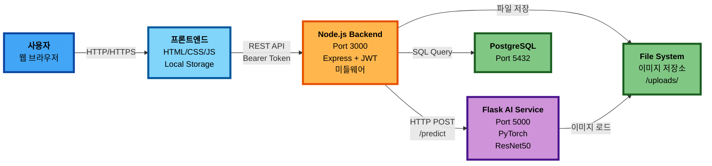

#### Detailed System Components
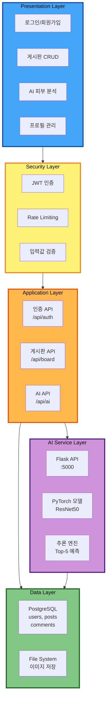

### 시스템 레이어 구조
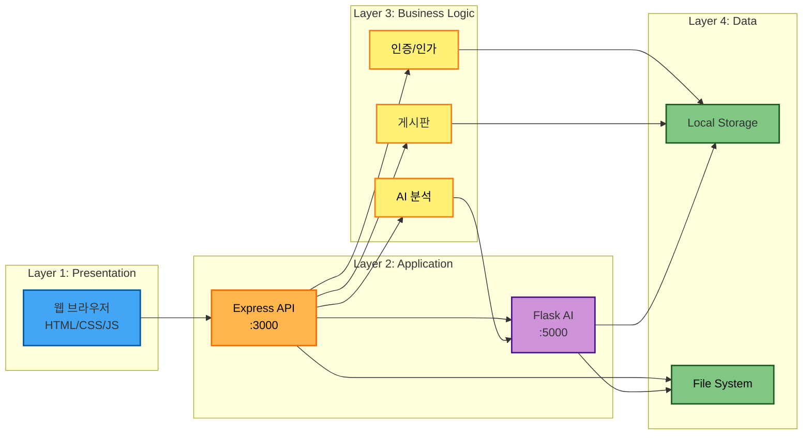

### 상세 계층 구조

#### 1. 클라이언트 계층
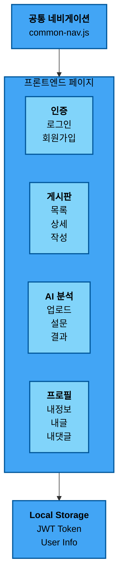

#### 2. 서버 계층
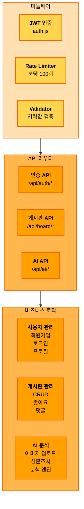

#### 3. 데이터 계층

**데이터베이스 ER 다이어그램**
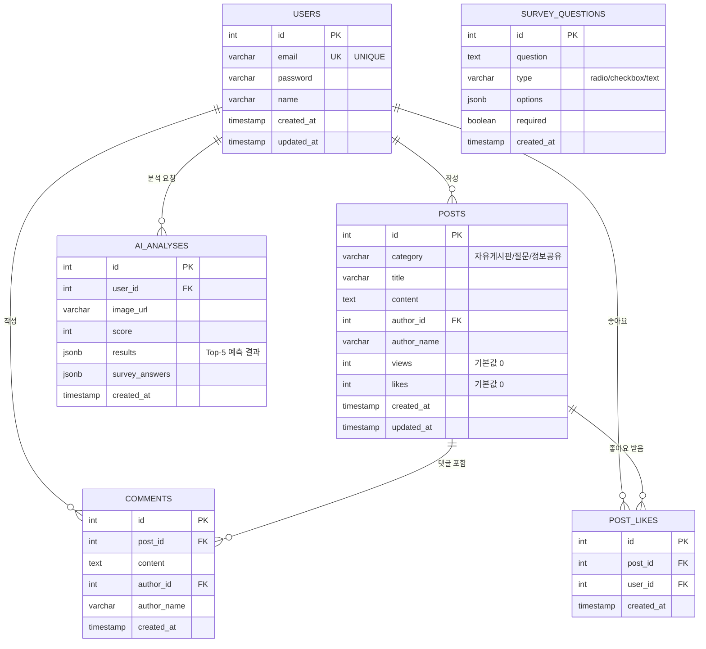

**스토리지 구조**
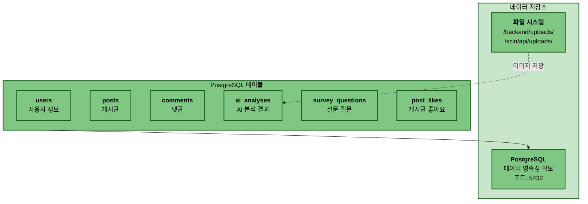

#### 4. 보안 계층
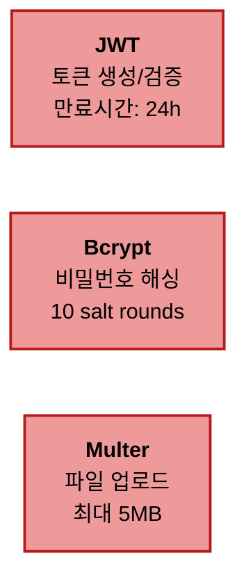

## 주요 컴포넌트 설명

### 1. 클라이언트 계층 

#### 프론트엔드 페이지
- **랜딩 페이지** (`index.html`): 서비스 소개 및 Hero 섹션
- **인증 페이지**: 로그인, 회원가입
- **게시판**: 메인 목록, 상세보기, 글쓰기/수정
- **프로필**: 사용자 정보 관리 (4개 탭 시스템)
- **AI 분석**: 피부 분석, 분석 기록, 결과 상세

#### 공통 기능
- **공통 네비게이션** (`common-nav.js`): 모든 페이지 통합 네비게이션
- **Local Storage**: JWT 토큰 및 사용자 정보 저장

### 2. 서버 계층 

#### Express 서버 (포트 3000)
Node.js 기반의 백엔드 서버로 모든 API 요청을 처리합니다.

#### 미들웨어
- **JWT 인증** (`auth.js`): 토큰 검증 및 사용자 인증
- **Rate Limiter** (`rateLimiter.js`): API 남용 방지
  - 일반 API: 분당 100회
  - 인증 API: 15분당 5회
  - 게시글 작성: 분당 3회
- **Validator**: `express-validator`를 통한 입력값 검증

#### API 엔드포인트 상세

**1. 인증 API** (`/api/auth/*`)

| Method | Endpoint | 인증 필요 | 설명 |
|--------|----------|---------|------|
| POST | `/signup` |  | 회원가입 |
| POST | `/login` |  | 로그인 |
| POST | `/logout` |  | 로그아웃 (클라이언트 처리) |
| GET | `/profile` |  | 프로필 조회 |
| PUT | `/profile` |  | 프로필 수정 (이름, 비밀번호) |
| DELETE | `/delete` |  | 회원탈퇴 |
| GET | `/my-posts` |  | 내가 쓴 글 목록 |
| GET | `/my-comments` |  | 내가 쓴 댓글 목록 |

**2. 게시판 API** (`/api/board/free/*`)

| Method | Endpoint | 인증 필요 | 설명 |
|--------|----------|---------|------|
| GET | `/posts` |  | 게시글 목록 조회 (검색, 카테고리 필터링) |
| POST | `/posts` |  | 게시글 작성 |
| GET | `/posts/:id` |  | 게시글 상세 조회 (조회수 증가) |
| PUT | `/posts/:id` |  | 게시글 수정 (작성자 확인) |
| DELETE | `/posts/:id` |  | 게시글 삭제 (작성자 확인) |
| POST | `/posts/:id/like` |  | 게시글 좋아요 (중복 방지) |
| POST | `/posts/:id/comments` |  | 댓글 작성 |
| DELETE | `/posts/:postId/comments/:commentId` |  | 댓글 삭제 (작성자 확인) |

**3. AI 분석 API** (`/api/ai/*`)

| Method | Endpoint | 인증 필요 | 설명 |
|--------|----------|---------|------|
| POST | `/image-upload` |  | 이미지 업로드 (5MB, JPG/PNG) |
| GET | `/survey/questions` |  | 설문 질문 목록 조회 |
| POST | `/survey/questions` |  | 설문 질문 추가 (관리자) |
| PUT | `/survey/questions/:id` |  | 설문 질문 수정 (관리자) |
| DELETE | `/survey/questions/:id` |  | 설문 질문 삭제 (관리자) |
| POST | `/survey` |  | 설문 제출 및 AI 분석 요청 |
| GET | `/analysis/:id` |  | AI 분석 결과 조회 (본인만) |
| GET | `/my-analyses` |  | 내 AI 분석 기록 목록 |

**4. Flask AI 서비스 API** (`:5000`)

| Method | Endpoint | 설명 |
|--------|----------|------|
| POST | `/predict` | 이미지 분석 (Top-5 질환 예측) |
| GET | `/health` | 서비스 상태 확인 |

### 3. 데이터 계층 

#### PostgreSQL 데이터베이스
 **데이터 영속성 확보**: PostgreSQL을 사용하여 모든 데이터가 안전하게 저장되며, 서버 재시작 후에도 유지됩니다.

#### 데이터베이스 테이블 스키마

**users** - 사용자 정보
```sql
CREATE TABLE users (
    id SERIAL PRIMARY KEY,
    email VARCHAR(255) UNIQUE NOT NULL,
    password VARCHAR(255) NOT NULL,
    name VARCHAR(100) NOT NULL,
    created_at TIMESTAMP DEFAULT CURRENT_TIMESTAMP,
    updated_at TIMESTAMP DEFAULT CURRENT_TIMESTAMP
);
```

**posts** - 게시글
```sql
CREATE TABLE posts (
    id SERIAL PRIMARY KEY,
    category VARCHAR(50) NOT NULL,
    title VARCHAR(255) NOT NULL,
    content TEXT NOT NULL,
    author_id INTEGER REFERENCES users(id) ON DELETE CASCADE,
    author_name VARCHAR(100) NOT NULL,
    views INTEGER DEFAULT 0,
    likes INTEGER DEFAULT 0,
    created_at TIMESTAMP DEFAULT CURRENT_TIMESTAMP,
    updated_at TIMESTAMP DEFAULT CURRENT_TIMESTAMP
);
```

**comments** - 댓글
```sql
CREATE TABLE comments (
    id SERIAL PRIMARY KEY,
    post_id INTEGER REFERENCES posts(id) ON DELETE CASCADE,
    content TEXT NOT NULL,
    author_id INTEGER REFERENCES users(id) ON DELETE CASCADE,
    author_name VARCHAR(100) NOT NULL,
    created_at TIMESTAMP DEFAULT CURRENT_TIMESTAMP
);
```

**ai_analyses** - AI 분석 결과
```sql
CREATE TABLE ai_analyses (
    id SERIAL PRIMARY KEY,
    user_id INTEGER REFERENCES users(id) ON DELETE CASCADE,
    image_url VARCHAR(500) NOT NULL,
    score INTEGER NOT NULL,
    results JSONB NOT NULL,
    survey_answers JSONB,
    created_at TIMESTAMP DEFAULT CURRENT_TIMESTAMP
);
```

**survey_questions** - 설문 질문
```sql
CREATE TABLE survey_questions (
    id SERIAL PRIMARY KEY,
    question TEXT NOT NULL,
    type VARCHAR(50) NOT NULL,
    options JSONB,
    required BOOLEAN DEFAULT true,
    created_at TIMESTAMP DEFAULT CURRENT_TIMESTAMP
);
```

**post_likes** - 게시글 좋아요 (다대다 관계)
```sql
CREATE TABLE post_likes (
    id SERIAL PRIMARY KEY,
    post_id INTEGER REFERENCES posts(id) ON DELETE CASCADE,
    user_id INTEGER REFERENCES users(id) ON DELETE CASCADE,
    created_at TIMESTAMP DEFAULT CURRENT_TIMESTAMP,
    UNIQUE(post_id, user_id)
);
```

#### 파일 시스템
- 업로드된 이미지는 `/backend/uploads/` 디렉토리에 로컬 저장
- 향후 AWS S3 또는 Cloudinary와 같은 클라우드 스토리지로 마이그레이션 예정

### 4. 보안 계층 

- **JWT**: JSON Web Token 기반 인증 (만료시간: 24시간)
- **Bcrypt**: 비밀번호 해싱 (10 salt rounds)
- **Multer**: 파일 업로드 제한 (최대 5MB, JPG/PNG만 허용)

## 주요 데이터 흐름

### 1. 인증 흐름
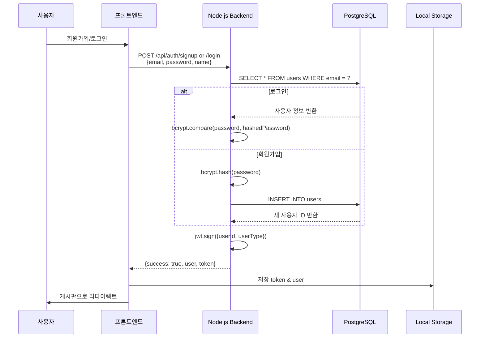

### 2. 인증이 필요한 API 호출 흐름
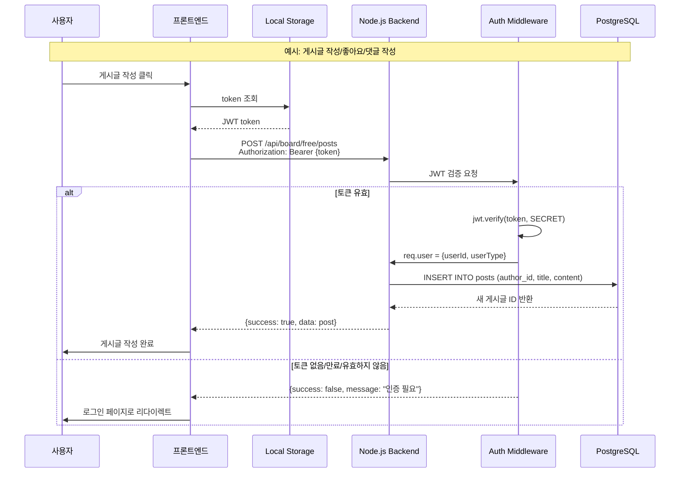

### 3. AI 피부 분석 흐름 (마이크로서비스 통신)
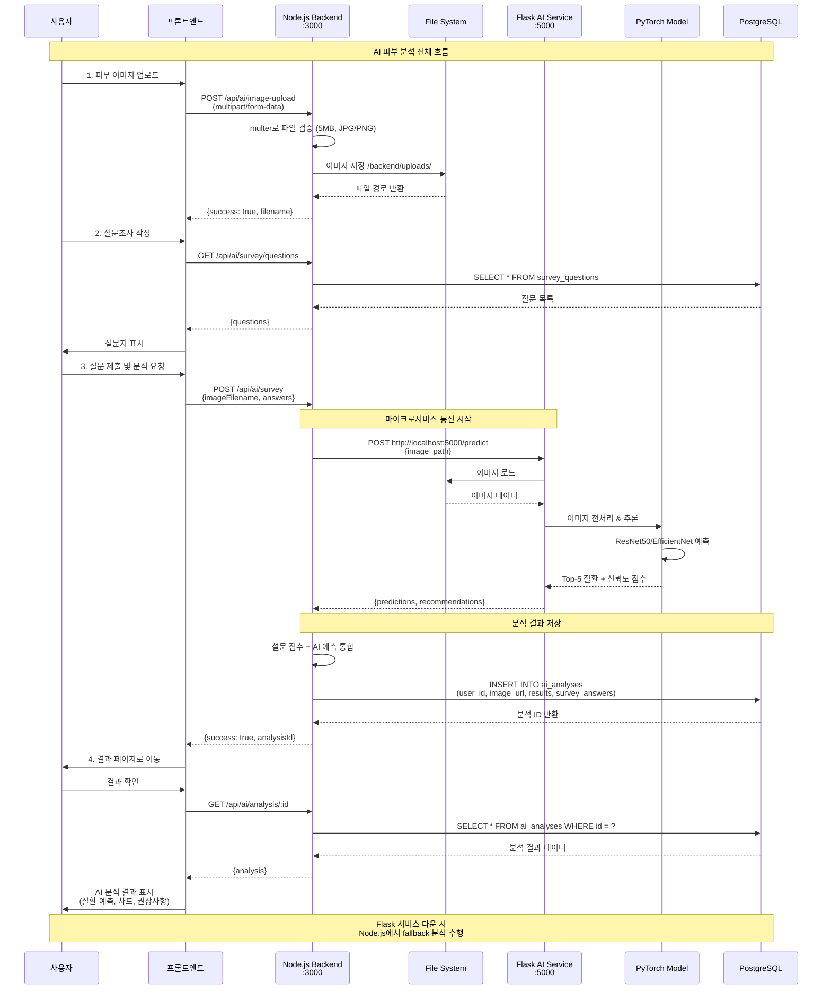

### 4. 게시판 게시글 작성 및 조회 흐름
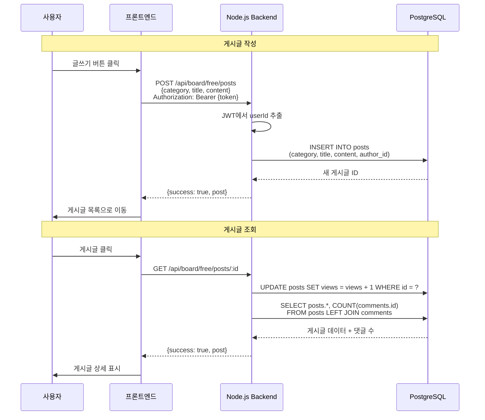

## 프로젝트 디렉토리 구조

### 전체 구조
```
SkinAI/
├── frontend/                    #  프론트엔드 (Vanilla JS)
│   └── src/
│       ├── index.html           # 랜딩 페이지
│       ├── script.js
│       ├── login.html           # 로그인
│       ├── signup.html          # 회원가입
│       ├── signup.js
│       ├── board.html           # 게시판 메인
│       ├── board.js
│       ├── post-detail.html     # 게시글 상세
│       ├── post-detail.js
│       ├── post-write.html      # 글쓰기/수정
│       ├── post-write.js
│       ├── profile.html         # 프로필 (4개 탭)
│       ├── profile.js
│       ├── ai-analysis.html     # AI 분석
│       ├── ai-analysis.js
│       ├── ai-result.html       # AI 결과 상세
│       ├── ai-result.js
│       ├── my-analyses.html     # AI 분석 기록
│       ├── common-nav.js        # 공통 네비게이션
│       └── style.css            # 전역 스타일
│
├── backend/                     #  Node.js 백엔드
│   ├── src/
│   │   ├── server.js            # Express 서버 진입점
│   │   ├── config/              # 설정 파일
│   │   │   ├── database.js      # PostgreSQL 연결
│   │   │   └── constants.js     # 상수 정의
│   │   ├── models/              # 데이터 모델
│   │   │   ├── user.js
│   │   │   ├── post.js
│   │   │   ├── comment.js
│   │   │   └── analysis.js
│   │   ├── middleware/          # 미들웨어
│   │   │   ├── auth.js          # JWT 인증
│   │   │   └── rateLimiter.js   # Rate limiting
│   │   └── routes/              # API 라우터
│   │       ├── auth.js          # /api/auth/*
│   │       ├── board.js         # /api/board/*
│   │       └── ai.js            # /api/ai/*
│   ├── uploads/                 # 이미지 저장소
│   ├── .env                     # 환경 변수  git 제외
│   ├── package.json
│   └── node_modules/
│
├── scin/                        #  AI 모델 시스템
│   ├── api/                     # Flask AI 서비스
│   │   ├── app.py               # Flask 서버 진입점
│   │   ├── config.py            # AI 설정
│   │   ├── inference.py         # 모델 추론
│   │   ├── start.sh             # 개발 서버 시작
│   │   ├── start_prod.sh        # 프로덕션 서버 시작
│   │   ├── uploads/             # AI 분석용 이미지
│   │   └── requirements.txt     # Python 의존성
│   ├── model/                   # 딥러닝 모델
│   │   ├── resnet50/            # ResNet50 모델
│   │   │   ├── model.py
│   │   │   ├── train.py
│   │   │   └── evaluate.py
│   │   └── efficientnet_b3/     # EfficientNet-B3 모델
│   │       ├── model.py
│   │       ├── train.py
│   │       └── evaluate.py
│   ├── data/                    # 데이터셋
│   │   ├── download.py          # SCIN 데이터셋 다운로드
│   │   ├── preprocess.py        # 데이터 전처리
│   │   └── scin_processed/      # 전처리된 데이터
│   ├── checkpoints/             # 학습된 모델 체크포인트
│   │   └── checkpoint_best.pth  # 최적 모델
│   └── logs/                    # 학습 로그
│
├── database/                    #  데이터베이스 (추가 예정)
│   ├── migrations/              # 스키마 마이그레이션
│   ├── seeds/                   # 초기 데이터
│   └── schema.sql               # PostgreSQL 스키마
│
├── README.md                    # 프로젝트 문서
├── Architecture.md              # 시스템 아키텍처 (현재 파일)
├── CLAUDE.md                    # Claude Code 가이드
└── package.json                 # 루트 패키지 설정
```

### 주요 디렉토리 설명

#### `frontend/src/` - 프론트엔드
- **정적 파일**: Express가 이 디렉토리를 정적으로 서빙
- **Vanilla JavaScript**: 프레임워크 없이 순수 JS 사용
- **공통 네비게이션**: `common-nav.js`로 모든 페이지 통합
- **Local Storage**: JWT 토큰 및 사용자 정보 저장

#### `backend/src/` - Node.js 백엔드
- **server.js**: Express 서버 진입점, 포트 3000
- **config/**: 데이터베이스 연결 및 상수 관리
- **models/**: PostgreSQL 테이블과 매핑되는 데이터 모델
- **middleware/**: JWT 인증, Rate limiting 등
- **routes/**: RESTful API 엔드포인트 정의

#### `scin/` - AI 모델 시스템
- **api/**: Flask 기반 AI 추론 서비스 (포트 5000)
- **model/**: PyTorch 기반 딥러닝 모델 (ResNet50, EfficientNet)
- **data/**: SCIN 데이터셋 다운로드 및 전처리 스크립트
- **checkpoints/**: 학습된 모델 가중치 파일

#### `database/` - 데이터베이스 관리 (추가 예정)
- **migrations/**: 데이터베이스 스키마 버전 관리
- **seeds/**: 초기 샘플 데이터
- **schema.sql**: PostgreSQL 테이블 정의

## 기술 스택

### 백엔드
- **Node.js**: 서버 런타임
- **Express**: 웹 프레임워크
- **PostgreSQL**: 관계형 데이터베이스
- **pg**: PostgreSQL 클라이언트 라이브러리
- **bcryptjs**: 비밀번호 해싱
- **jsonwebtoken**: JWT 토큰 생성 및 검증
- **express-validator**: 입력값 검증
- **express-rate-limit**: Rate limiting
- **multer**: 파일 업로드
- **dotenv**: 환경 변수 관리
- **axios**: HTTP 클라이언트 (Flask AI 서비스 통신)

### AI 서비스 (Flask)
- **Python 3.8+**: AI 서비스 런타임
- **Flask**: 경량 웹 프레임워크
- **PyTorch 2.0+**: 딥러닝 프레임워크
- **torchvision**: 이미지 변환 및 모델
- **Pillow**: 이미지 처리
- **Gunicorn**: 프로덕션 WSGI 서버

### 프론트엔드
- **Vanilla JavaScript**: 순수 자바스크립트
- **HTML5/CSS3**: 마크업 및 스타일링
- **Fetch API**: 서버 통신

## 보안 기능

### 구현됨 
- JWT 인증 미들웨어
- 모든 Board API 및 AI API 인증 적용
- Rate Limiting (API 남용 방지)
- 비밀번호 bcrypt 해싱
- 입력값 검증 (express-validator)
- 중복 이메일 체크
- 에러 메시지 일반화
- 파일 업로드 제한 (5MB, JPG/PNG)

### 미구현 
- CORS 설정
- HTTPS 지원
- 파일 업로드 악성코드 검사
- 세션 관리
- 비밀번호 재설정
- 이메일 인증

## 알려진 제한사항

> **경고**: 이 프로젝트는 학습/프로토타입 목적입니다. 프로덕션 환경에 배포하지 마세요.

1. **데이터베이스 최적화**
   - 데이터베이스 인덱스 최적화 필요
   - 쿼리 성능 튜닝 필요
   - 커넥션 풀 크기 조정 필요

2. **성능 이슈**
   - 페이지네이션 없음 (모든 게시글 한번에 로드)
   - 로컬 이미지 저장 (클라우드 스토리지 미사용)
   - Flask AI 서비스와 HTTP 통신 오버헤드

3. **AI 분석 제한**
   - Flask 서비스 다운 시 fallback 분석만 가능
   - 이미지 파일 크기 제한 (최대 5MB)
   - 실시간 분석 속도 개선 필요

## 개선 로드맵

### Phase 1: 보안 강화  완료
- [x] JWT 인증 미들웨어 구현
- [x] 모든 API 인증 적용
- [x] Rate limiting 추가

### Phase 2: UI/UX 개선  완료
- [x] 현대적인 랜딩 페이지
- [x] 통합 네비게이션 시스템
- [x] 프로필 페이지 탭 시스템
- [x] 게시판 카테고리 시스템
- [x] 반응형 디자인

### Phase 3: AI 모델 통합  완료
- [x] 이미지 업로드
- [x] AI 피부 분석 시스템
- [x] Flask AI 서비스 마이크로서비스 아키텍처
- [x] PyTorch 기반 ResNet50/EfficientNet-B3 모델 통합
- [x] 50가지 피부 질환 분류 시스템

### Phase 4: 데이터베이스 연동  진행 중
- [x] PostgreSQL 연동
- [x] 데이터 영속성 확보
- [ ] 데이터베이스 스키마 마이그레이션
- [ ] 인덱싱 추가 및 쿼리 최적화
- [ ] 커넥션 풀 설정
- [ ] 클라우드 이미지 스토리지

### Phase 5: 기능 확장
- [x] 게시글 검색
- [ ] 페이지네이션
- [ ] 비밀번호 재설정
- [ ] 이메일 인증
- [ ] 알림 시스템

### Phase 6: 프로덕션 준비
- [ ] HTTPS & CORS 설정
- [ ] 로깅 & 모니터링 시스템
- [ ] 배포 자동화 (Docker, CI/CD)
- [ ] 성능 최적화 및 캐싱
- [ ] 부하 테스트

## 시스템 요약

### 서비스 포트 및 URL

| 서비스 | 포트 | URL | 설명 |
|--------|------|-----|------|
| **프론트엔드** | 3000 | http://localhost:3000 | Express 정적 파일 서빙 |
| **Node.js Backend** | 3000 | http://localhost:3000/api/* | RESTful API |
| **Flask AI Service** | 5000 | http://localhost:5000 | AI 추론 서비스 |
| **PostgreSQL** | 5432 | localhost:5432 | 데이터베이스 |

### 주요 기술 스택 요약

```
┌─────────────────────────────────────────────────────────────┐
│  프론트엔드: Vanilla JavaScript + HTML5/CSS3                │
├─────────────────────────────────────────────────────────────┤
│  백엔드 API: Node.js + Express + JWT                        │
├─────────────────────────────────────────────────────────────┤
│  AI 서비스: Flask + PyTorch + ResNet50/EfficientNet         │
├─────────────────────────────────────────────────────────────┤
│  데이터베이스: PostgreSQL 14+                                │
├─────────────────────────────────────────────────────────────┤
│  보안: JWT + Bcrypt + Rate Limiting                         │
└─────────────────────────────────────────────────────────────┘
```

### 데이터베이스 테이블 요약

- **users** - 사용자 정보 (인증, 프로필)
- **posts** - 게시글 (자유게시판, 질문, 정보공유)
- **comments** - 댓글 (게시글에 대한 댓글)
- **post_likes** - 게시글 좋아요 (다대다 관계)
- **ai_analyses** - AI 분석 결과 (JSONB)
- **survey_questions** - 동적 설문 질문 (JSONB)

### 주요 데이터 흐름 요약

1. **인증**: 사용자 → Frontend → Backend → PostgreSQL → JWT 발급
2. **게시판**: 사용자 → Frontend → Backend (JWT 검증) → PostgreSQL
3. **AI 분석**: 사용자 → Frontend → Backend → Flask AI → PyTorch → PostgreSQL

### 보안 체계

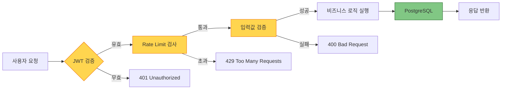

## 참고 문서
- [README.md](./README.md): 프로젝트 전체 문서 및 빠른 시작 가이드
- [CLAUDE.md](./CLAUDE.md): Claude Code 개발 가이드 및 Clean Code 규칙
- [SCIN_데이터_모델_분석_리포트.md](./SCIN_데이터_모델_분석_리포트.md): AI 모델 분석 리포트

---

**문서 버전**: 2.0
**마지막 업데이트**: 2024-11-26
**작성자**: SkinAI Development Team
